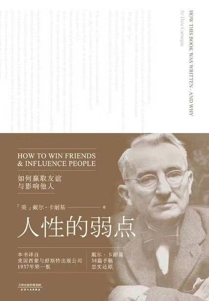

# 人性的弱点

戴尔.卡耐基

◆ 自序

>> 个人的成功也只有百分之十五是源自专业能力，另外的百分之八十五则来自“人类工程学”，即人格特质和领导能力。

>> 但想要拿到高薪，他们必须在专业技能之外还具备表达能力、领导能力和激发他人工作热情的能力。

>> 教育，即为解决生活问题的能力。

>> 教育的最大目的并非增进知识，而是增进行动。

◆ 使用本书的九个建议

>> 这个要求是什么呢？那就是强烈的学习欲望，以及提高人际交往能力的坚定决心

>> 人际交往能力决定了我的受欢迎程度、我的幸福感和自我价值。

>> 我曾经花了两年时间撰写一本公共演讲方面的书。在写作过程中我总要时时回看，才能记得自己写过的内容。人们遗忘的速度是非常惊人的。

>> 请记住，只有不断积极地温习并应用，才能将理论变为习惯。

>> 萧伯纳曾经说过：“人们永远无法被‘教’会。”他是对的。学习是自主的活动过程，人们从实践中学习。

>> 抓住每一个机会运用这些理论。如果你不做，很快就会忘记。只有使用过的知识才会牢牢在你脑海中扎根。

>> 你并非在汲取知识，而是在培养新的习惯，寻求一种新的生活态度。这需要时间、坚持和在日常生活中的不断实践。

>> ，请不要听任自己的本能反应，因为第一反应往往是错的。请把书翻到你重点标记的那些章节，试试这些全新的理念，看看它们不可思议的效果。

◆ Chapter 01 人际关系的基本技巧

>> 沃纳梅克很早就参透的道理，我却摸索了几十年才认识到——百分之九十九的情况下，不管犯下多严重的错误，人们都不会责备自己。

>> 批评是无用的，它激起抵触，让人急于辩白；批评是危险的，它伤害自尊，甚至让人萌生恨意。

>> 你都看到了——这就是人性。作恶者怪罪所有人，却从不悔过。世人皆是如此。

>> 和人打交道时，请牢记这一点——人并非理性生物。他们由情感驱使，被偏见支配，傲慢与虚荣是他们的动力之源。

>> 批评、指责和抱怨是蠢材与生俱来的“才能”；理解和宽容却是对人品和自律的极大考验。

>> 西格蒙德·弗洛伊德称，对性和成功的欲望是人类的永恒动机。

>> 杜威博士说，人性中最深层的动力是“对重视的渴求”。

>> 下述即是人人都渴求得到的：1.健康长久的生命2.食物3.睡眠4.金钱，以及金钱能换来的东西5.来世灵魂不灭6.性生活的满足7.子女幸福安康8.被重视的感受

>> 通常情况下，这些需求不难实现，只有一点是例外；这一点，弗洛伊德称之“对成功的欲望”，杜威谓之“对重视的渴求”。人们对它的渴望，与对食物和睡眠的渴望同样迫切，却难以餍足。

>> 不知道你是否注意到，他并没有用“希望”、“想要”或是“向往”等温和的措辞，他的原话是“强烈渴求

>> 如果我们的祖先没有感受到人性的召唤，强烈渴求成就感，我们就不会有现今的文明。没有这一渴求，人类无异于动物。

>> 如果你愿意告诉我什么事情最让你有满足感，我就能知道你是怎样的人。这一点决定了你的个性，对你的人生之路也具有最重大的影响。

>> 为了博得同情和关注，人们有时会假装弱小，从而获得存在感。

>> 人们如此渴望他人的认同，甚至不惜以发疯为代价。由此可见，人们有多么需要被重视，真诚的称赞能创造多大的奇迹。

>> “我的能力在于激发周围人的热情，”施瓦布说，“我拥有的最大资本，是赞赏和鼓励，我以此方式激发人们的潜能。

>> “没有什么比上司的批评更打击一个人的积极性了。我从未批评过任何人。我认为给人们正面激励对工作至关重要，所以我喜欢鼓励他人，不愿意吹毛求疵。如果我看到任何闪光点，我会由衷地赞许，不吝啬赞美之词。”

>> 人们像渴求食物一样渴求被认同。

>> 与人打交道时请不要忘记，我们身边的每个人都是渴求认同的平凡人。普天之下的每一颗心，都会因他人的赞许而欢愉。

>> 此生之路，我将走过；走过这一次，便再也无法重来。所有力所能及的善行，所有充盈于心的善意，我将毫不吝惜，即刻倾予。我将再不拖延，再不淡漠，只因此生之路，再也无法重来。

>> 人们会将你的话语珍藏一生，当你已经将这些话置于脑后，对方仍会在心底一遍遍重温。

>> 真心实意地感谢他人、赞美他人」

>> 你当然在乎你想要的一切，这是人之常情，正常人永远都只在乎自己的欲望。然而其他人对你的欲求毫无兴趣，他们和你一样，只在意自己想要什么。

>> 所以普天之下唯一能够影响他人的方式，就是找出他们想要什么，并且教给他们如何获得。

>> 行为根植于人类的根本欲望……无论在商界、政界，还是家庭或学校，说服别人的首要途径，是引发对方的强烈欲求。能者纵横天下，庸者踽踽独行。”

>> “如果成功有诀窍的话，”亨利·福特如是说，“这个诀窍就在于洞悉他人的立场，并能够同时兼顾自己和他人的立场。”

>> 这世界从不缺少贪婪成性、自私自利之人。能够站在他人角度考虑、真诚地帮助他人的人却少之又少。因此后者必将卓然于众，无可匹敌。

>> “对于那些能够设身处地为他人着想、洞悉他人心理的人，未来已经准备好了给他们的奖赏。”

>> 了解对方的需求，从而激发对方的兴趣，并不等同于操纵他人、损人利己

>> 原则1 不要批评，不要指责，不要抱怨原则2 真心实意地感谢他人、赞美他人原则3 激发他人的需求

◆ Chapter 02 赢得他人喜爱的六个方式

>> 事实就是这么简单。发自内心地关注他人，不出两个月，你就能交到许多朋友；只想博得他人的关注，哪怕两年，你也交不到朋友。

>> 漠视同胞之人，生活最为艰辛，给周遭带来的伤害也最为深痛。置身于这样的个体周围，人类命运有如堕入寒冬，生机难复”。

>> 我们对他人的兴趣，以他人对我们的兴趣为前提。

>> 而我想说的是，双方的兴趣，皆以“真”为前提。真诚是为人处世的基础。无论表达关切的一方，还是被关注的一方，只有你情我愿，才能互惠互利

>> 如果你希望被他人喜爱，如果你渴求真正的友情，如果你希望助己的同时助人，请记住下面这个原则：「原则 1建立对他人的兴趣，真心诚意地关注他人」

>> “人们往往认为感觉先于行为，但实际上，感觉与行为是同步的。相较于情绪，个人意志对行为的影响更为直接，只要调整行为，我们就能够间接地调整情绪。

>> 幸福并非取决于外在条件，而是取决于心理状态。

>> 请在脑海中仔细勾勒理想的形象，笃定的想法将帮助你一步步成长为那个美好真诚、才华横溢的自己。思想是至高无上的。请端正心态，学会无畏、坦率、乐观，因为正确的思维是创造一切的前提。心想是事成之因，虔诚的祷告者必将得到回应。倘若你心意坚定，你就不会迷失方向。收紧下颔，高昂起头——你将成为自己的神。

>> 于是他反问我觉得他缘何成功。我回答说：“我知道你叫得出一万个人的名字。”“不，你错了，”他说，“我至少记得五万个人的名字。”

>> 富兰克林·罗斯福懂得这个重要的道理——只有尊重别人，才能赢得尊重。因此他通过记住对方名字让对方感到被重视。这个方法再简单不过了，但有几个人能够真正做到呢？

>> 无论对于何人，无论以何种语言，自己的名字都是世界上最甜蜜最重要的词汇」

>> 真正令她兴趣盎然并自我感觉良好的，是有人愿意倾听她的经历。

>> 专注的倾听是我们能够给予他人的最高赞许。

>> 关注是最含蓄的谄谀。极少有人对他人一心一意的关注无动于衷”。

>> 请记住，你的谈话对象并不关心你和你的问题，而对他们自己、他们的欲望和烦恼要感兴趣得多。

>> 专注地倾听，鼓励他人谈论自己」

>> 每次有客人来访的时候，罗斯福都会在前一天晚上提前了解对方感兴趣的话题，一直钻研至深夜。谈论对方最在乎的事情，是直抵对方内心深处的捷径。罗斯福深知这一点。所有领袖都深知这一点。

>> 谈论对方感兴趣的事情」

>> 如果人人都如此自私阴暗，付出一点小小的善意和一句真诚的称赞都索求回报；如果我们的灵魂渺小如尘沙，那么失败是注定应得的惩罚。

>> 人类行为有一个核心法则。遵循这一法则，你将远离灾祸，得到良师益友和幸福安宁；触犯这一律法，困难就会接踵而至。那就是——令他人感到重要。

>> 人性的根源深处，强烈渴求着他人的欣赏”；

>> 无论何事，你们愿意人怎样待你们，你们也要怎样待人。”

>> 「原则 6真心实意地让对方知道他有多重要」

>> 「小结赢得他人喜爱的六个方式」原则1 建立对他人的兴趣，真心诚意地关注他人原则2 微笑原则3 无论对于何人，无论以何种语言，自己的名字都是世界上最甜蜜最重要的词汇原则4 专注地倾听，鼓励他人谈论自己原则5 谈论对方感兴趣的事情原则6 真心实意地让对方知道他有多重要

◆ Chapter 03 如何让他人想你之所想

>> 但是戴尔，别忘了我们是宴会上的客人。为什么一定要分个胜负呢？这样会让他对你有好印象吗？为什么就不能给他留点面子呢？人家又没有问你的意见——他根本不需要你的意见。你又何必一定要和他争？别总是自己往枪口上撞。

2023/06/06发表想法
个人认为，不争论只是一种方式，并不是用于所有场景
>> 这些经历教给我一个道理——普天之下，赢得争论的方法只有一个，那就是避免争论。请把争论视同响尾蛇，或是地震——人人避之唯恐不及。

>> 不要纵容直觉反应。面对不利处境，人类的本能使我们下意识地进入戒备模式。这时请格外注意。保持冷静，警惕你的本能反应——它会使你成为最糟的那个你，而非状态最好的那个你。

>> 先听，后说。给对方说话的机会，听他们把话说完。反驳和争辩只会徒增隔阂。建立沟通的桥梁，不要筑起误解的壁垒。

>> 向对方承诺你会认真考虑他的想法，并且说到做到。对方很有可能是正确的。借这个机会深思熟虑，总好过事后被对方指责“我们告诉过你，可你就是不听”。真心诚意地感谢对方的重视。对方愿意花时间和你争辩，是因为他和你对同一件事感兴趣。将他们视为真心愿意帮助你的人，也许就能化敌为友。

>> 「原则 1赢得争论的方法只有一个，那就是避免争论」

>> 如果你能够保证百分之五十五的正确率，那么你完全有资格在华尔街日进斗金；如果你不能保证，那么有何底气断定是别人错了？

>> 永远别以“让我证明你哪里错了……”为开头。这是一步差棋。说这句话就等同于在说：“我比你聪明。我要教教你，让你改变想法。”这就如同下战书一样，引发对方的敌意。还没等你开口，听者就想和你决斗。

>> “潜移默化，人方受教；斥其无知，不如称其易忘。”

>> 你无法教会他人，唯一能做的，只是引导他自行领悟。”

>> 要比所有人都聪明，但不要告诉他们这一点。

>> “我唯一知道的，是我一无所知。”

>> 承认自己有可能犯错并不意味着惹祸上身，反而会令你远离纷争。你的开阔胸怀会感染对方，令对方力求如你一般公正宽容，甚至承认他也有可能是错的。

>> 世间理性之人极少，大部分人都充满偏见，其认知被成见、戒备、猜疑、恐惧、妒忌和傲慢所束缚。没有人愿意改变他们对信仰、发型或是偶像的看法。

>> 我们总是固守那些早已成型的认知，一旦遭受质疑，我们就会心生抵触，为了保护自己认定的事实而寻找各种理由。结果导致我们所宣称的“理性”，实际上只是徒然地捍卫自己的成见而已。

>> 当我们犯错的时候，也许会向自己承认；如果对方温和友善，也许我们会向对方承认，并为自己的广阔胸襟感到自豪；但如果对方道出了难堪的事实，并强令我们接受，我们绝不会妥协。

>> 如果你想了解为人处世之道，提升个人魅力，不妨读一读本杰明·富兰克林的自传。

>> “现在我确信，直言不讳地说对方错了非但没有任何益处，还会引发种种恶果。你唯一的收获就是践踏了对方的自尊，让你自己在任何场合都不受欢迎。”

>> 早在两千年前，耶稣就曾说：“你同告你的对头还在路上，就赶紧与他和息。”而在基督降世的两千两百年前，埃及法老也曾经告诫子孙：“圆融处事，方能达到目的。”这句话直到今天仍然成立。换句话说，请不要与客户、爱人或是敌人争辩。不要直接指出他们的错误或激怒他们。请圆融处事。

>> 「原则 2尊重他人的观点，绝不要说“你错了”」

>> 警官也是凡夫俗子，也渴望被重视；当我抢先开始自责时，唯一能够让他自我感觉良好的方式，是通过对我的怜悯显示他的宽宏大量。

>> 在对方开口之前抢得先机，自己检讨，把对方想说的话说出来，不给他留任何余地。百分之九十九的情况下，等待你的将会是宽容和原谅。

>> 请记得这句古老的格言：“斗争无法餍足人类，退让却能令人受益匪浅。”

>> 「原则 3如果你错了，请坚决果断地承认错误」

>> “一滴蜜比一加仑胆汁更能吸引飞蝇。”这一古老的谚语对于人类同样适用。如果你想要得到他人的赞同，请先让他相信你是他忠实的伙伴，这是俘获他心灵的那一滴蜜糖；凭借这一滴蜜糖，你就能够赢得他的心。

>> 与人商谈时，请先强调你赞同的观点，不要急于挑明分歧。如果可能的话，请让对方了解，你们的差异在于方法而非目的。

>> 一旦说出了“不”字，你的自尊心就会迫使你坚持己见。即使你意识到这个“不”说得太轻率，你的尊严也不会给你食言的机会

>> 让对方称“是”的策略听起来简单，却总是被人忽视。人们似乎习惯以冒犯他人的方式找寻存在感。

>> 无论你面对的是学生、顾客、孩童还是伴侣，如果对方在一开始以“不”作答，那么你需要过人的智慧和耐心，才能变拒绝为肯定。

>> 想要反驳对方的时候，请记得苏格拉底的谋略，温和地抛出问题——一个答案为“是”的问题。

>> 中国古谚云：“轻履者行远。”五千年的文化令中国人深谙人性，“轻履者行远”这句话饱含着古老的东方智慧。

>> 「原则 5让对方点头称“是”」

>> 人们总是喋喋不休，期望借此改变对方的观点。请给对方一点说话的时间，听听他们的所思所想。他们比你更了解自己的生意和自己的难题。不妨向他们提问，让他们告诉你答案。

>> 当对方急于倾诉的时候，无论你说什么他都听不进去。所以请耐心地听他们说完，鼓励对方将他的想法和盘托出。

>> 再知心的朋友也更愿意在我们面前谈论他们的成就，而不是听我们自吹自擂。

>> 若想树敌，就胜于你的朋友；若想交友，请让朋友胜于你。

>> 较之别人灌输给你的想法，你是不是更相信自己得出的结论？如果答案是肯定的，为什么还要把自己的观点强加于人呢？循循善诱，让对方自己得出结论才是明智之举。

>> 我们喜欢被问及我们的心愿、我们的需求、我们的想法。

>> 江海之所以能为百谷王者，以其善下之，故能为百谷王。是以圣人欲上民，必以言下之；欲先民，必以身后之。是以圣人处上而民不重，处前而民不害。是以天下乐推而不厌。以其不争，故天下莫能与之争。”

>> 「原则 7循循善诱，让对方自行得出结论」

>> 认真问问自己：“如果我是他，我会怎么想，又会怎么做？”这会为你节省时间，避开不必要的麻烦，你的人际交往能力也会因此日益精进。“一旦理解了昨日之因，我们就不再纠结于今日之果。”

>> 你对个人事务有多上心，对世间万物就有多冷漠。然而世人皆是如此。只要认识到这一点，你就像林肯和罗斯福一样，抓住了人际关系的本质。同理心是为人处世的制胜之道。

>> “若想让交流变得顺畅，请像重视自己的感受一样重视对方。请在商谈之初就表明议题，并在开口之前先斟酌一下，如果你是对方，你愿不愿意听这些话。如果你希望对方认可你的观点，请先接受他的观点。”

>> 请先不要急于行动。闭上眼睛，站在对方的角度考虑一下，问问你自己：“对方为什么要这样做？”尽管这样很花时间，但却能够减少摩擦、化敌为友，让你少走冤枉路。

>> 面谈之前，我宁愿花两个小时站在门口，想清楚我要说什么，对方的兴趣如何、动机如何、会怎样回答，而不是贸然地冲进对方办公室。

>> 「原则 8抛开成见，将心比心」

>> 世间存在这样一个神奇的句式。它能够平息争执，消除猜忌，引发好感，并让对方侧耳倾听。想知道这句话吗？请听好——“我一点都不怪你这样想。如果我是你，我也会有完全相同的感受。”

>> 在你一生遇到的人中，有四分之三的人都渴求他人的体谅。那就如他们所愿吧，他们会因此对你产生好感。

>> 人类普遍渴求同情。孩童给别人看伤口，甚至故意把自己弄伤，借此博取同情……成人同样如此。他们展示创伤，讲述所经历的事故、病痛或是手术细节。无论这些不幸是现实还是假想，‘自怜’都普遍存在于人类行为之中。”

>> 「原则 9体谅他人的想法和愿望」

>> 每个人的行为背后都有两个原因——一个高尚的借口，和一个真正的动机。

>> 如果你想改变他人，请帮他们想出这个更高尚的理由。

>> 「原则 10激发对方内心深处的高尚情操」

>> 这就是戏剧化的作用。道出事实远远不够；你需要以生动、有趣、戏剧化的手段吸引受众。电

>> 无论在工作上还是在生活中，你都可以戏剧性地夸大你的想法，这一手段简单易行。

>> 「原则 11戏剧化你的想法」

>> 以查尔斯·施瓦布的原话说：“竞争产生效率。这里的竞争并不是指名利心，而是超越他人的渴望。”

>> 超越他人的渴望！激将法！下战书！但凡对方有一点好胜心，这个方法绝对有效。

>> “人人心间都有恐惧，唯有勇士能够放下恐惧，奋勇前行。即使战死沙场，也是值得自豪的胜利。

>> 我从不认为单凭薪水就能吸引人才并留住他们，”费尔斯通轮胎橡胶公司的创始人哈维·费尔斯通如是说，“留住他们的是竞争本身。

>> 「原则 12激将法」

>> 原则1 赢得争论的方法只有一个，那就是避免争论原则2 尊重他人的观点，绝不要说“你错了”原则3 如果你错了，请坚决果断地承认错误原则4 沟通始于友善原则5 让对方点头称“是”原则6 让对方主导谈话原则7 循循善诱，让对方自行得出结论原则8 抛开成见，将心比心原则9 体谅他人的想法和愿望原则10 激发对方内心深处的高尚情操原则11 戏剧化你的想法原则12 激将法

◆ Chapter 04 如何改变他人，成为领导者

>> 称赞的话语如同牙医诊疗时的麻醉剂，虽然牙钻仍会令患者感到不适，但是麻醉剂能够有效地缓解疼痛。作为领导者，应当学会：

>> 「原则 1欲抑先扬」

>> 纠正他人错误最有效的方式是——「原则 2间接地引起对方的注意」

>> 卓越领袖都会遵从下面的原则：「原则 3批评对方之前，先谈谈你自己的过错」

>> 即使出发点是好的，颐指气使的命令也会令人怀恨在心。

>> 将命令改为问句不仅听起来更悦耳，还能够激发创造力。如果对方参与了决策过程，他就更乐于付诸实施。

>> 聪明的领导者懂得：「原则 4以引导代替命令」

>> 给对方留面子——这一点至关重要，却往往被我们置于脑后。我们践踏他人的感受，横冲直撞，一意孤行；我们在他人面前训斥孩子或是下属，随心所欲，毫不留情。我们从未顾及对他们自尊心造成的伤害，而这些伤害原本只需要几分钟的思考或是几句贴心的话语就能够轻易化解。

>> 即使你手握真理，对方大错特错，也请给对方留个面子。让对方丢脸除了会摧毁他的自尊心之外，别无益处。

>> 真正的领导者会：「原则 5给对方留足面子」

>> “赞许的话语如同抚慰人心的温煦日光，灵魂缺少它的滋养就无法像花朵般盛放。然而大多数人对于同胞只有寒风般凛冽的责难，从不愿给予些许阳光般和暖的夸奖。”

>> 如果将批评降至最低限度而着重强调表扬，人们的善举会被巩固，不良行径因为未被关注会逐渐弱化。

>> 人人都喜欢被称赞，但只有具体化的称赞才能够使人信服，不会被对方当作安慰话一笑置之。

>> 请允许我再次重复：书中所授全部原则，只有出自真心，才能够发挥应有的效用。

>> 「原则 6夸奖他人每一点微小的进步，“由衷地赞许，不吝啬赞美之词”」

>> 不妨相信对方已经具备你所期望的美德，并且把你的信念传递给对方，对方定会竭尽全力维护他在你心目中的形象。

>> 「原则 7用美誉激励他人，他就会努力不辜负你的期望」

>> 如果你想帮助他人进步，请记得：「原则 8鼓励对方勇于改变，让改正错误听起来轻而易举」

>> 如果想改变对方的态度或行为，领导者须将下述建议谨记在心：1.实事求是。做不到的事情请不要承诺。忘记自己的私利，关注对方的利益；2.目的明确。清楚知道你希望对方做什么；3.有同理心。扪心自问什么是对方真正的需求；4.换位思考。想一想对方帮你做事能得到哪些好处；5.利益交换。找到上述好处与对方需求的结合点；6.表明态度。提出请求的时候，向对方说明他如何能从中受益。

>> 想让他人做某事的话，就请：「原则 9让对方乐于为你做事」

>> 原则1 欲抑先扬原则2 间接地引起对方的注意原则3 批评对方之前，先谈谈你自己的过错原则4 以引导代替命令原则5 给对方留足面子原则6 夸奖他人每一点微小的进步，“由衷地赞许，不吝啬赞美之词”原则7 用美誉激励他人，他就会努力不辜负你的期望原则8 鼓励对方勇于改变，让改正错误听起来轻而易举原则9 让对方乐于为你做事

◆ Chapter 06 幸福家庭生活的七个法则

>> 如果你希望婚姻幸福，请记得：「原则 1别唠叨了」

>> 请记住这个重要的观点：“婚姻的第一课，是学会尊重对方独有的生活之道。”

>> 如果你希望婚姻美满，请：「原则 2不要试图改变对方」

>> 村野老夫　糟糠之妻生活起落无常　携手笑看悲喜

>> 如果你想让婚姻幸福，请记得：「原则 3请勿责难」

>> 对于女人在化妆打扮上花费的种种努力，男人应当时时表示赞赏。男人们总是忽视女人对于时装有多么热衷。女人上街的时候，几乎很少看男人；她们的关注点完全在于街上的其他女人是怎么穿着打扮的。

>> 不要羞于让对方知道她对你有多重要

>> 「原则 4真心诚意地欣赏对方」

>> “令人心碎的不是爱情的消逝，而是它消逝时我们竟懵懂不知。”

>> 此生之路，我将走过；走过这一次，便再也无法重来。所有力所能及的善行，所有充盈于心的善意，我将毫不吝惜，即刻倾予。我将再不拖延，再不疏忽，只因此生之路，再也无法重来。

>> 「原则 5细微之处见真情」

>> 婚姻远比事业更加重要，甚至堪称生死攸关。

>> 如果你希望家庭和睦，请：「原则 6谦和有礼」

>> 失败的婚姻通常由四个原因导致，按重要性排序如下：1.性生活失调；2.对于闲暇时光该如何度过的想法不同；3.经济困难；4.身体、精神或情感状况异常。

>> 「原则 7读一本解析婚姻中性事的好书」

>> 「小结幸福家庭生活的七个法则」原则1 别唠叨了原则2 不要试图改变对方原则3 请勿责难原则4 真心诚意地欣赏对方原则5 细微之处见真情原则6 谦和有礼原则7 读一本解析婚姻中性事的好书

◆ 译后记 你就是自己的神明

>> 预测未来的最好方式，是亲手创造它。”
